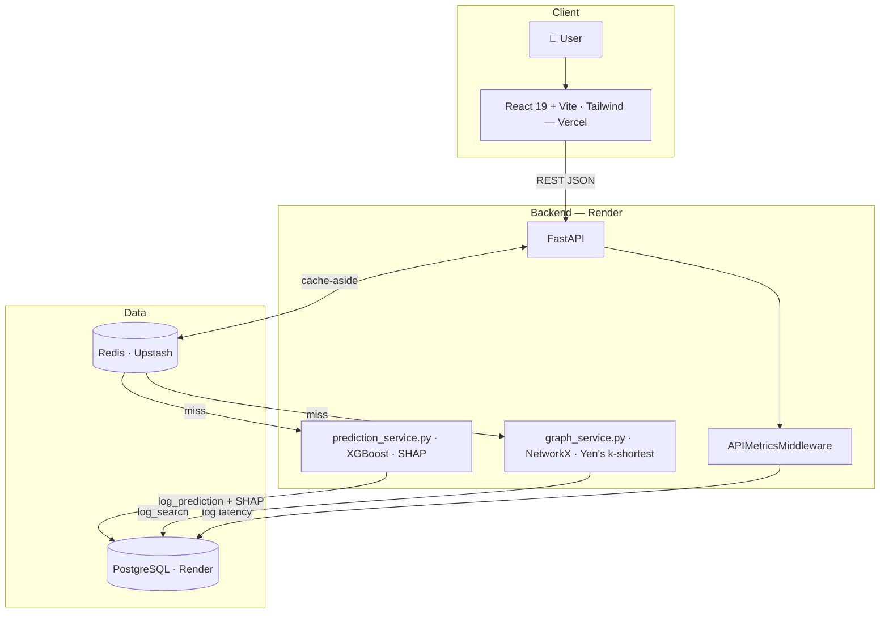
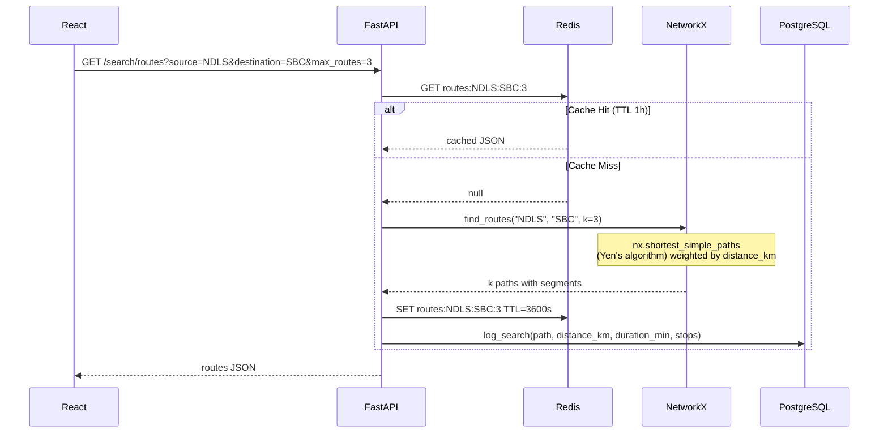
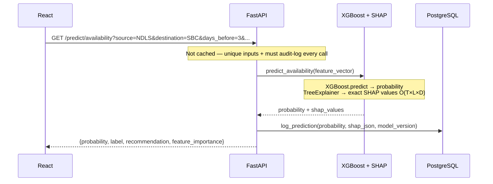

<div align="center">

# 🚆 TatkalX

**Intelligent Tatkal ticket booking assistant for Indian Railways**

[](https://fastapi.tiangolo.com/)
[](https://react.dev/)
[](https://xgboost.readthedocs.io/)
[](https://shap.readthedocs.io/)
[](https://postgresql.org/)
[](https://redis.io/)
[](https://vercel.com/)
[](https://render.com/)

[**🌐 Live Demo**](https://tatkal-x.vercel.app) · [**📘 API Docs**](https://tatkalx-backend.onrender.com/docs) · [**⚙ Backend**](https://tatkalx-backend.onrender.com)

</div>

---

TatkalX answers two questions every Indian railway passenger asks before booking a Tatkal ticket:

**Which route should I take?** — Yen's k-shortest paths algorithm finds up to 5 alternative routes through a weighted NetworkX graph of 18 major Indian stations, ranked by total distance. Users get real alternatives, not just the one shortest path.

**Will I actually get a seat?** — An XGBoost regressor predicts seat availability probability (0–100%), and SHAP TreeExplainer shows exactly which factors drove the prediction. Every prediction is logged to PostgreSQL for analytics.

> **Note:** The backend is deployed on Render's free tier. The first request after a period of inactivity may take approximately 30 seconds while the service wakes up.

---

## Table of Contents

- [Limitations](#-limitations)
- [Features](#-features)
- [Architecture](#-architecture)
- [Request Flow](#-request-flow)
- [Tech Stack & Decisions](#-tech-stack--decisions)
- [Project Structure](#-project-structure)
- [Local Setup](#-local-setup)
- [API Reference](#-api-reference)
- [ML Model](#-ml-model)
- [Caching Strategy](#-caching-strategy)
- [Database Schema](#-database-schema)
- [Technical Q&A](#-technical-qa)
- [Future Improvements](#-future-improvements)

---

## ⚠ Limitations

- The availability model is trained on **synthetic data** — IRCTC provides no public historical booking API. The model demonstrates an end-to-end ML + XAI pipeline, not production-grade prediction.
- The railway graph covers **18 major stations**. Expansion to 1000+ stations is a planned improvement.

---

## ✨ Features

### 🚉 Route Intelligence
- Yen's k-shortest paths on a weighted graph of 18 stations, 33 edges (distance km + avg duration hrs)
- Up to 5 alternative routes with per-segment breakdown (from, to, distance, duration)
- Direct vs. multi-hop classification, stop count, total journey stats
- Routes cached in Redis for 1 hour (`routes:{src}:{dst}:{k}`) — cache misses automatically compute the result and populate the cache.
### 🤖 Availability Prediction
- XGBoost regressor trained on 10,000 domain-engineered synthetic samples
- 7 features: days before journey, travel class, day of week, month, route popularity, is_tatkal, hour of booking
- Outputs: probability (0–1), label (HIGH / MEDIUM / LOW), natural-language recommendation
- SHAP TreeExplainer renders an exact waterfall chart per prediction.
- Every prediction logged to PostgreSQL with full SHAP JSON

### 📊 Analytics & Observability
- 11 REST endpoints over PostgreSQL: popular routes, 30-day search trend, peak booking hours, high-risk routes, weekday stats
- All analytics responses cached in Redis (TTL: 5 min)
- `APIMetricsMiddleware` logs endpoint, method, HTTP status, and response ms for every request

### ⚡ Infrastructure
- Cache-aside pattern with graceful Redis fallback — cache failure is non-fatal
- PostgreSQL connection pooling configured for reliable cloud deployment and efficient connection management.
- Alembic migrations with a single versioned initial schema

---

## 🏗 Architecture



---

## 🔄 Request Flow

### Route Search



### Availability Prediction



---

## 🛠 Tech Stack & Decisions

| Component | Choice | Rationale |
|---|---|---|
| **Route algorithm** | Yen's k-shortest (`nx.shortest_simple_paths`) | Dijkstra returns one path. Users need alternatives when the fastest train is fully booked. |
| **ML model** | XGBoost Regressor | Outperforms linear models on tabular features with nonlinear interactions. Native SHAP support. |
| **Explainability** | SHAP TreeExplainer | Exact — O(T×L×D). KernelExplainer uses sampling approximation and is 10–100× slower for tree models. |
| **Cache pattern** | Cache-aside | Read-heavy workload. Routes are deterministic and never mutated. Write-through would add invalidation logic with no benefit. |
| **Prediction caching** | None | (1) Predictions are intentionally not cached because each prediction is stored for analytics and the diversity of input combinations makes cache reuse unlikely. for the analytics trail. (2) Input cardinality makes hit rate near zero. |
| **Redis TTLs** | Routes 1h · Stations 24h · Analytics 5min | Stations are static. Routes are pure graph math. Analytics aggregations tolerate 5-min staleness. |
| DB pool | SQLAlchemy Connection Pool | Configured for reliable database connectivity and compatibility with Render's free-tier deployments. |
| **Deployment** | Render (API + PG) + Vercel (frontend) | Vercel CDN edge for static assets. Render managed PostgreSQL with automatic backups. Both free-tier compatible. |

---

## 📂 Project Structure

```
tatkalx/
├── backend/
│   ├── alembic/
│   │   └── versions/0bb22471eae0_initial_schema.py
│   ├── app/
│   │   ├── core/
│   │   │   ├── config.py             # Pydantic settings — reads .env
│   │   │   └── redis.py              # RedisClient: get/set/ping/metrics
│   │   ├── data/
│   │   │   ├── stations.py           # 18-station graph nodes + weighted edges
│   │   │   └── training_data.py      # Synthetic XGBoost training data generator
│   │   ├── middleware/
│   │   │   └── api_metrics.py        # Logs latency + status for every request
│   │   ├── routes/
│   │   │   ├── search.py             # /search/routes · /search/stations
│   │   │   ├── predict.py            # /predict/availability
│   │   │   └── analytics.py          # 11 analytics endpoints
│   │   ├── services/
│   │   │   ├── graph_service.py      # build_graph() + find_routes() via Yen's
│   │   │   └── prediction_service.py # XGBoost singleton + SHAP inference
│   │   └── main.py
│   ├── database/
│   │   ├── connection.py             # Engine, QueuePool, get_db context manager
│   │   ├── models.py                 # ORM: Station, SearchHistory, Prediction, APIMetric
│   │   ├── operations.py             # All DB operations centralised here
│   │   └── seed_data.py              # 100 real Indian stations with zone, lat, lon
│   ├── scripts/
│   │   └── init_db.py                # One-shot DB bootstrap + idempotent station seeding
│   ├── models/                       # XGBoost .pkl (git-ignored)
│   └── train.py
│
└── frontend/
    └── src/
        ├── api/client.js             # Centralised fetch calls
        ├── components/
        │   ├── StationSelect.jsx
        │   ├── RouteSearch.jsx       # Tab 1: k-route results with segment breakdown
        │   ├── AvailabilityCheck.jsx # Tab 2: prediction form + probability bar
        │   └── SHAPExplanation.jsx   # Horizontal waterfall chart
        └── App.jsx
```

---

## 🚀 Local Setup

### Prerequisites

- Python 3.11+, Node.js 20+, PostgreSQL 16, Redis (or [Upstash](https://upstash.com/) free tier)

### Backend

```bash
git clone https://github.com/Sahaj-Bajaj/TatkalX.git
cd tatkalx/backend

python -m venv venv
venv\Scripts\activate          # Windows
# source venv/bin/activate     # macOS/Linux

pip install -r requirements.txt

# Configure .env
DATABASE_URL=postgresql://postgres:<password>@localhost:5432/tatkalx
REDIS_HOST=<upstash-host>
REDIS_PORT=6379
REDIS_PASSWORD=<upstash-password>
REDIS_SSL=True

python scripts/init_db.py      # Create tables + seed 100 stations
python train.py                # Train XGBoost → models/availability_model.pkl

uvicorn app.main:app --reload
# API  → http://localhost:8000
# Docs → http://localhost:8000/docs
```

### Frontend

```bash
cd tatkalx/frontend
npm install
echo "VITE_API_URL=http://localhost:8000" > .env.local
npm run dev
# → http://localhost:5173
```

---

## 📡 API Reference

### `GET /search/routes`

| Param | Type | Default | Description |
|---|---|---|---|
| `source` | string | required | Station code e.g. `NDLS` |
| `destination` | string | required | Station code e.g. `SBC` |
| `max_routes` | int | `3` | 1–5 |

```json
{
  "source": { "code": "NDLS", "name": "New Delhi" },
  "destination": { "code": "SBC", "name": "KSR Bengaluru" },
  "routes_found": 3,
  "routes": [{
    "path": ["NDLS", "BPL", "NGP", "SC", "SBC"],
    "is_direct": false,
    "stops": 3,
    "total_distance_km": 2128,
    "total_duration_hrs": 29.0,
    "segments": [{ "from": "NDLS", "to": "BPL", "distance_km": 704, "duration_hrs": 8.0 }]
  }]
}
```

### `GET /predict/availability`

| Param | Type | Description |
|---|---|---|
| `source` / `destination` | string | Station codes |
| `days_before` | int 1–120 | Days until journey |
| `travel_class` | string | `SL`, `3A`, `2A`, `1A` |
| `day_of_week` | int 0–6 | 0=Mon … 6=Sun |
| `month` | int 1–12 | Journey month |
| `is_tatkal` | bool | Tatkal quota |
| `hour_of_booking` | int 0–23 | Tatkal opens at 10 |

```json
{
  "availability_probability": 0.71,
  "label": "HIGH",
  "recommendation": "Good availability. Book at opening time for best chance.",
  "feature_importance": {
    "top_features": [
      { "feature": "days_before_journey", "shap_value":  0.184, "importance": 0.184 },
      { "feature": "route_popularity",    "shap_value": -0.122, "importance": 0.122 },
      { "feature": "is_tatkal",           "shap_value": -0.091, "importance": 0.091 }
    ]
  }
}
```

### Other Endpoints

```
GET /search/stations            100 stations — Redis cached 24h
GET /analytics                  Full dashboard payload
GET /analytics/summary          KPI counts (searches, predictions, success rate)
GET /analytics/popular          Most searched routes
GET /analytics/trend?days=30    Daily search volume
GET /analytics/peak-hours       Searches by hour (0–23)
GET /analytics/risk             Highest average predicted difficulty
GET /analytics/weekdays         Average probability by day of week
GET /analytics/health           Endpoint latency + DB status
GET /analytics/cache            Redis hit/miss metrics
GET /health                     DB + Redis connectivity
```

---

## 🤖 ML Model

### Training Data

| Feature | Effect on availability |
|---|---|
| `days_before_journey` | Exponential decay: `−0.3 × e^(−days/10)` |
| `is_tatkal` | −35% base; additional −15% at 10 AM rush |
| `travel_class` | SL −20% · 3A −8% · 2A +5% · 1A +18% |
| `route_popularity` (1–5) | −6% per level |
| `day_of_week` | Fri/Sat/Sun −10% |
| `month` | Oct–Jan, May–Jun −10% (peak seasons) |
| `hour_of_booking` | Tatkal × 10AM = additional −15% |

The model is trained on a domain-engineered synthetic dataset using a train/test split and evaluated using standard regression metrics.

### Configuration

```python
The model is implemented using XGBoost and serialized with Joblib for efficient loading during application startup. The model and SHAP explainer are initialized once and reused for all prediction requests.
```

Saved to `models/availability_model.pkl` via `joblib`. The model and SHAP explainer are initialized during application startup and reused for subsequent requests. — no per-request overhead. SHAP `TreeExplainer` is also initialised once alongside the model.

---

## ⚡ Caching Strategy

```
┌──────────────────────────┬────────┬─────────────────────────────────┐
│ Key pattern              │ TTL    │ Reason                          │
├──────────────────────────┼────────┼─────────────────────────────────┤
│ stations:all             │ 24h    │ Seeded once; never changes      │
│ routes:{s}:{d}:{k}       │ 1h     │ Deterministic graph computation │
│ analytics:*              │ 5min   │ Expensive SQL aggregations      │
│ predictions              │ NONE   │ Must audit-log + high cardinality│
└──────────────────────────┴────────┴─────────────────────────────────┘
```

If Redis is unavailable, the application automatically falls back to direct computation without interrupting requests. If Upstash is unreachable, requests fall through to compute normally. Cache failure is a latency regression, not an outage.

---

## 🗄 Database Schema

```sql
stations        — 100 seeded stations (code, name, city, state, zone, lat, lon, is_major)
search_history  — Every route search (source, dest, path JSON, distance, algorithm, ms)
predictions     — Every prediction (probability, SHAP JSON, model_version, ms)
api_metrics     — Every HTTP request (endpoint, method, status_code, response_ms)
```

Key indexes: composite `(source_station_code, destination_station_code)` on `search_history` for popular-routes aggregation; `delay_probability` on `predictions` for high-risk-routes query; `created_at` on all tables for windowed analytics.

---

## 💬 Technical Q&A

**Why Yen's k-shortest paths instead of Dijkstra?**
Dijkstra returns one optimal path. Yen's returns k alternatives ranked by cost. In a Tatkal context users need fallback routes — if the fastest path's trains are fully booked, what is the next option? `nx.shortest_simple_paths` implements Yen's algorithm and returns a lazy generator, so paths are computed on demand.

**Why TreeExplainer over KernelExplainer?**
TreeExplainer exploits tree structure to compute exact Shapley values in O(T×L×D) time. KernelExplainer is model-agnostic but estimates values via background sampling — 10–100× slower and less accurate for tree models. TreeExplainer is preferred because it provides exact SHAP values for tree-based models while being substantially faster than KernelExplainer.

**Why cache-aside instead of write-through?**
The graph is built once at startup and never mutated. Cache-aside (populate on first miss, expire by TTL) is correct and simple. Write-through would add invalidation logic for updates that never happen.

**What happens if Redis goes down?**
Every Redis call is inside `try/except Exception`. On failure, `result` is `None` and the request falls through to NetworkX or PostgreSQL. The response is identical — only latency increases.

**Why are predictions not cached?**
Two reasons: (1) every prediction must be written to PostgreSQL for the analytics layer — a cache hit silently skips the audit trail; (2) input cardinality (source × destination × days × class × tatkal × hour × month) makes the hit rate negligible.

**Why `pool_pre_ping=True`?**
Render's free tier may close idle database connections. SQLAlchemy's connection pool is configured to automatically validate and refresh stale connections, improving reliability after cold starts.

**Why synthetic training data?**
IRCTC has no public booking API. Real Tatkal availability data is proprietary. The generator in `training_data.py` encodes domain knowledge — Tatkal opens at 10 AM, SL fills fastest, peak seasons in Oct–Jan and May–Jun — to produce realistic distributions. The project demonstrates the end-to-end ML + XAI pipeline, not a production predictor.

**Walk me through a full prediction request.**
React calls `GET /predict/availability` → FastAPI validates with Pydantic → `predict_availability()` builds a 7-feature DataFrame → XGBoost singleton predicts probability → SHAP TreeExplainer computes exact contributions → result and SHAP JSON logged to `predictions` → response returned as `{probability, label, recommendation, feature_importance}` → frontend renders the probability bar and SHAP waterfall chart.

---

## 🗺 Future Improvements

- Expand railway graph to 1,000+ stations using NTES data
- Train-specific route search (filter by available trains on a date)
- User accounts and saved journey history
- Automated model retraining pipeline
- Personalized booking recommendations based on past searches

---

## Built With

[FastAPI](https://fastapi.tiangolo.com/) · [NetworkX](https://networkx.org/) · [XGBoost](https://xgboost.readthedocs.io/) · [SHAP](https://shap.readthedocs.io/) · [SQLAlchemy](https://www.sqlalchemy.org/) · [Alembic](https://alembic.sqlalchemy.org/) · [Upstash](https://upstash.com/) · [React 19](https://react.dev/) · [Tailwind CSS](https://tailwindcss.com/) · [Render](https://render.com/) · [Vercel](https://vercel.com/)

---

<div align="center">

Made by Sahaj Bajaj

Electrical Engineering Undergraduate
Malaviya National Institute of Technology Jaipur

</div>